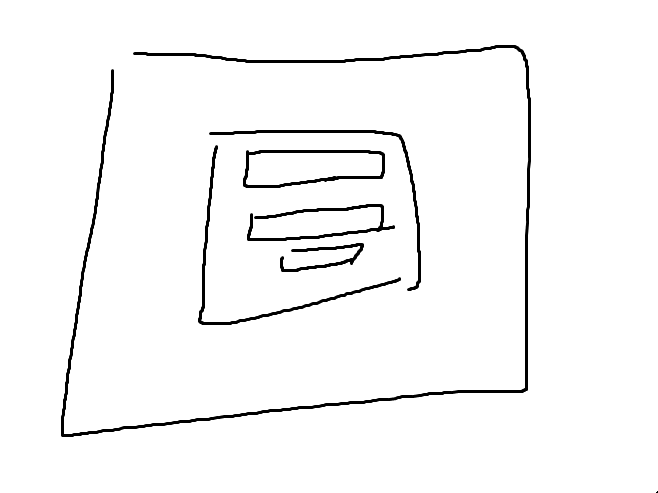
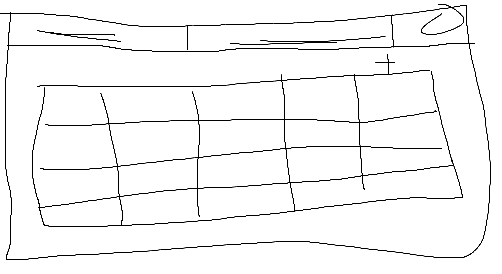
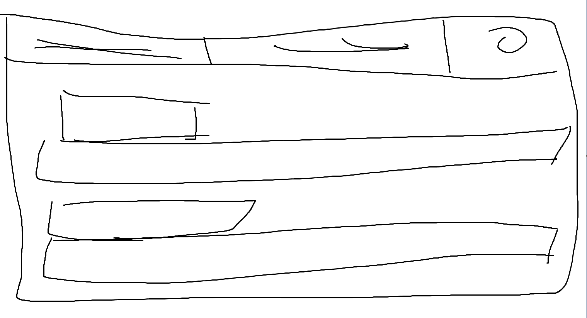
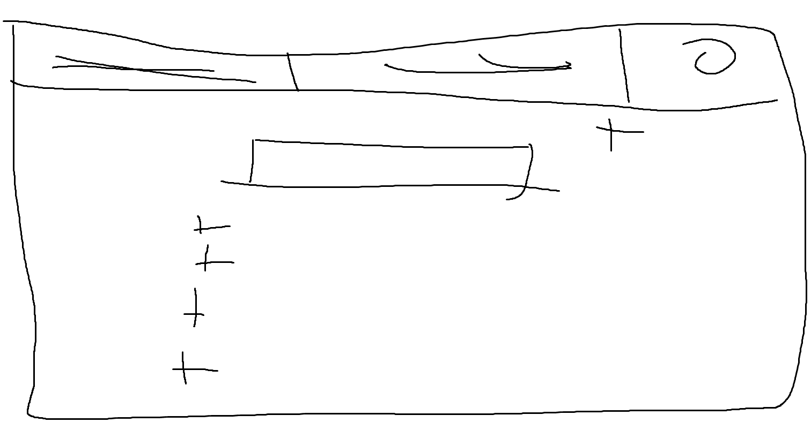

# Projektplan

## 1. Projektbeskrivning (Beskriv vad sidan ska kunna göra).
Gymsida

Min sida skall vara en hemsida där en user eller PT kan logga in eller registrera sig. Usern ska kunna lägga till workouts till sitt schema som en PT har gjort. Usern ska kunna ta bort sina workouts. PTn ska kunna göra workouts som usern ska kunna använda, även redigera existerande workouts. Usern ska kunna ha många workouts och en workout ska kunna ha många users. En PT ska kunna ha gjort många workouts men workouts ska bara kunna ha en PT.
## 2. Vyer (visa bildskisser på dina sidor).

## 3. Databas med ER-diagram (Bild på ER-diagram).

## 4. Arkitektur (Beskriv filer och mappar - vad gör/innehåller de?).

första mappen innehåller det som autogenererats av yardoc

andra mappen innehåller databasen

tredje mappen innehåller mer innehåll från autogenerering av yardoc

fjärde mappen är misc mappen, den innehåller bilder

femte är public mappen, den innehåller en css map som innehåller en css fil

sjätte mappen är views mappen som innehåller alla slimfiler, filerna följer restful routes och det finns mappar specifikt för övningar och program

därefter kommer app.rb, innehåller inte all logik eftersom den mesta koden utförs i model.rb som kommer sedan, utan här är det mest att variablerna kommer in, för att sedan skickas ut

åttonde är model.rb, här hittar vi den mesta logiken som sedan skickar tillbaka resultatet till app.rb